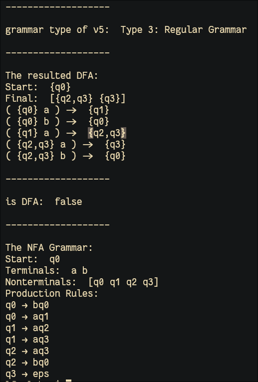

# Laboratory Work 2

## Theory and Definitions

### Alphabet

A finite nonempty set of symbols. By convention denoted as $\Sigma$. For
example:

$$ \Sigma = \set{0, 1} \text{ binary alphabet} $$

$$ \Sigma = \set{ a, b, \dots, z } \text{ the set of lowercase letters} $$

### Grammar

A grammar is what defines the rules of a language, it is defined as a 5
sized toople:

$$ G = (V_{N}, V_{T}, P, S) $$

where:
- $V_{N}$ a finite set of *non-terminal symbols*  
- $V_T$ - a is a finite set of *terminal symbols*  
- $S$ - is the starting point  
- $P$ - is a finite set of productions of rules  

Additionally *terminals* and *non-terminals* don't have common symbols

$$V_N \cap V_T = \emptyset $$

### Production

A production is the set of rules a grammar follows. It is defined as:

$$ P = \set{ \alpha \to \beta \mid \alpha, \beta \in (V_{N} \cup V_{T})^*, \alpha \ne \epsilon } $$

### Deterministic Finite Automata

A 5-tuple:

$$ DFA = (Q, \Sigma, \delta, q_{0}, F) $$

where:
- $Q$ - a finite set of states $\Sigma$ - an alphabet
- $\delta : Q \times \Sigma \rightarrow Q$ (a transition function)
- $q_{0} \in Q$ - the initial state $F \subset Q$ - a set of accepting/final states

### Language of a DFA

the language of a DFA is the set of all strings over $\Sigma$ that
start from $q_{0}$, follow the transitions as the string is read
left to right and reach some accepting/final state.

### Equivalence of DFA with Regular Grammar

For the given $DFA = (Q, \Sigma, \delta, q_0, F)$ can be obtained an
equivalent regular grammar $G = (V_N, V_T, P, S)$.

Algorithm:

1.  $V_N = Q$
2.  $V_T = \Sigma$
3.  $S = \set{q_0}$
4.  For production $P$:
    - $P = \emptyset$
    - For all values:  
      $\delta(q, a) = (q_1, q_2, \dots, q_m)$
      we have  
      $P = P\cup \set{ q \rightarrow aq_i \mid  i = 1\dots m }$
    - for the values with  
      $F \cap \set{ q_1, q_2, \dots, q_m} \neq \emptyset$
      we have  
      $P = P\cup \set{q \rightarrow a}$

### NFA to DFA
for every NFA there is a DFA. we do this by tracking "configurations of states" of the NFA in a new nfa.

The algorithm is as follows:

1. **Initialize** a queue (`nfaQueue`) to track unprocessed NFA state sets and create empty DFA components (`deltaPrime`, `qPrime`, `fPrime`).  
2. **Start state**: Convert the NFA’s start states into a single DFA state and enqueue it.  
3. **Process states**: While there are unprocessed sets, dequeue a state set and check if it contains a final NFA state (add it to `fPrime` if so).  
4. **Transition mapping**: For each symbol in the alphabet, compute the union of reachable NFA states, forming a new DFA state.  
5. **Enqueue new states**: If the computed state set is new, enqueue it and add it to `qPrime`.  
6. **Update DFA transitions (`deltaPrime`)** to map the current DFA state to the new state on the given symbol.  
7. **Repeat** until all reachable NFA states are processed, then return the constructed DFA.

### Grammar types
The **Chomsky Hierarchy** classifies grammars into four types based on their production rules:  

#### **1. Type 0: Recursively Enumerable Grammar (Unrestricted)**
   - **Most powerful** grammar type.
   - Productions: **Any form** (e.g., `α → β`, where `α` and `β` are strings of terminals & non-terminals).
   - **Can generate any language a Turing machine can recognize**.
   - Example: `AB → BCaB`  

#### **2. Type 1: Context-Sensitive Grammar (CSG)**
   - Productions: **Left-hand side (LHS) must be at most as long as the right-hand side (RHS)** (`|α| ≤ |β|` in `α → β`).
   - **Can be recognized by a Linear Bounded Automaton (LBA)**.
   - Example: `AB → ABC`  

#### **3. Type 2: Context-Free Grammar (CFG)**
   - Productions: **Single non-terminal on LHS** (`A → β`).
   - **Recognized by a Pushdown Automaton (PDA)**.
   - Used in **programming languages** and **compilers**.
   - Example: `S → aSb | ε`  

#### **4. Type 3: Regular Grammar**
   - Productions: **LHS is a single non-terminal, RHS is a terminal followed by at most one non-terminal** (`A → aB` or `A → a`).
   - **Recognized by Finite Automata (FA)**.
   - Used for **lexical analysis (regex, DFA, NFA)**.
   - Example: `S → aS | b`  


#### **Hierarchy:**
```
Type 0 ⊇ Type 1 ⊇ Type 2 ⊇ Type 3
```
- **Every Regular Language is Context-Free**.
- **Every Context-Free Language is Context-Sensitive**.
- **Every Context-Sensitive Language is Recursively Enumerable**.


## Objectives:
1. Understand what an automaton is and what it can be used for.

2. Continuing the work in the same repository and the same project, the following need to be added:
    a. Provide a function in your grammar type/class that could classify the grammar based on Chomsky hierarchy.

    b. For this you can use the variant from the previous lab.

3. According to your variant number (by universal convention it is register ID), get the finite automaton definition and do the following tasks:

    a. Implement conversion of a finite automaton to a regular grammar.

    b. Determine whether your FA is deterministic or non-deterministic.

    c. Implement some functionality that would convert an NDFA to a DFA.

    d. Represent the finite automaton graphically (Optional, and can be considered as a __*bonus point*__):
        - You can use external libraries, tools or APIs to generate the figures/diagrams.
        - Your program needs to gather and send the data about the automaton and the lib/tool/API return the visual representation.

## Implementation

My variant is

```
Variant 5:

NFA:
Q = {q0,q1,q2,q3},
Sigma = {a,b},
F = {q3},
delta(q0,a) = q1,
delta(q0,b) = q0,
delta(q1,a) = q2,
delta(q1,a) = q3,
delta(q2,a) = q3,
delta(q2,b) = q0.

Previous lab grammar:
VN={S, F, L},
VT={a, b, c, d},
P={
    S → bS
    S → aF
    S → d
    F → cF
    F → dF
    F → aL
    L → aL
    L → c
    F → b
}
```

I continued to use golang for this lab work, naively thinking it would be easy to do so. Implementing the FA was especially chalanging due to the limitations of golang's type system. Since a DFA delta function and NFA delta function are not symmetric types. This blocked my progress for a while. In the end I chose to implement a separate nfa type, and ditch the idea of interfaces and generics.

### The New Structs

For the NFA implementation I needed:


```go
type NFA struct {
	Q     []State
	Sigma []byte
	Delta DeltaNfa
	Q0    []State
	F     []State
}

func NewNFA(Q []State, Sigma []byte, Delta DeltaNfa, Q0 []State, F []State) *NFA {

	nfa := &NFA{
		Q:     Q,
		Sigma: Sigma,
		Delta: Delta,
		Q0:    Q0,
		F:     F,
	}

	return nfa
}
```

and the other types that the NFA needs like the delta.
For the delta function, I went with a "bidimensional" map again. The first key is the state, the second key is the symbol, and the value is a set of states. This worked well for the NFA since multiple states can be reached from one transition. But it also meant I needed a separate DeltaNfa type with methods like Add() to add transitions and Lookup() to fetch the next states. This design made the conversion from NFA to DFA much easier to handle.

```go
type DeltaNfa map[State]map[byte]setState

func (d DeltaNfa) Add(in State, r byte, out setState) {
	if _, ok := d[in]; !ok {
		d[in] = make(map[byte]setState)
	}
	d[in][r] = out
}

func (d DeltaNfa) Lookup(in State, r byte) setState {
	if q, ok := d[in]; !ok {
		return nil
	} else {
		return q[r]
	}
}
```

For state representation, I made State an alias to string, thinking it would simplify things. Turns out, it mostly did, but it also meant I had to be extra careful when merging states during the NFA-to-DFA transformation. Since Go doesn’t have a built-in set type (why, Go?), I had to implement my own. The trick was to use a `map[string]bool`, where the keys are the actual state names, and the boolean values don’t really matter. This let me quickly check for membership, merge sets, and compare them without extra overhead.

The setState type needed some essential methods to be useful. Add() to insert elements, Union() to merge two sets, Equals() to compare sets, and toState() to convert a set of states into a single, sorted string representation. The last one was necessary to keep things deterministic, otherwise, different orderings of the same states would create duplicate DFA states.

```go
type setState map[string]bool

func NewSetState(states ...State) setState {
	s := make(setState)
	for _, state := range states {
		s[state] = true
	}
	return s
}

func (s setState) toState() State {
	buff := make([]string, 0)
	for q := range s {
		buff = append(buff, q)
	}

	sort.Slice(buff, func(i, j int) bool {
		return buff[i] < buff[j]
	})

	return "{" + strings.Join(buff, ",") + "}"
}

func (s setState) Add(state State) {
	s[state] = true
}

func (s setState) Union(s2 setState) {
	for k := range s2 {
		s[k] = true
	}
}

func (s setState) Equals(s2 setState) bool {
	if len(s) != len(s2) {
		return false
	}
	for k := range s {
		if _, ok := s2[k]; !ok {
			return false
		}
	}
	return true
}
```

### The ToDFA function

To better handle the transition from an NFA to a DFA, I had to ensure that the `ToDFA` function correctly processed sets of states instead of single states, hence the distinct `setState` type.

The algorithm from above:

1. **Initialize** a queue (`nfaQueue`) to track unprocessed NFA state sets and create empty DFA components (`deltaPrime`, `qPrime`, `fPrime`).  
2. **Start state**: Convert the NFA’s start states into a single DFA state and enqueue it.  
3. **Process states**: While there are unprocessed sets, dequeue a state set and check if it contains a final NFA state (add it to `fPrime` if so).  
4. **Transition mapping**: For each symbol in the alphabet, compute the union of reachable NFA states, forming a new DFA state.  
5. **Enqueue new states**: If the computed state set is new, enqueue it and add it to `qPrime`.  
6. **Update DFA transitions (`deltaPrime`)** to map the current DFA state to the new state on the given symbol.  
7. **Repeat** until all reachable NFA states are processed, then return the constructed DFA.

Here we implement the algorithm defined above:

```go
func (n *NFA) ToDFA() *DFA {
	nfaQueue := newNFAQueue()
	deltaPrime := make(DeltaDFA)

	qPrime := make([]State, 0)
	fPrime := make([]State, 0)

	q0 := make(setState)
	for _, q := range n.Q0 {
		q0.Add(q)
	}

	nfaQueue.enqueue(q0)
	qPrime = append(qPrime, q0.toState())

	for !nfaQueue.done() {
		currentSetState := nfaQueue.dequeue()

		for _, f := range n.F {
			if currentSetState[f] {
				fPrime = append(fPrime, currentSetState.toState())
				break
			}
		}

		for _, r := range n.Sigma {
			out := make(setState)
			for state := range currentSetState {
				if nextStates := n.Delta.Lookup(state, r); nextStates != nil {
					out.Union(nextStates)
				} 
			}

			if len(out) > 0 {
				if !nfaQueue.wasProcessed(out) {
					nfaQueue.enqueue(out)
					qPrime = append(qPrime, out.toState())
				}

				deltaPrime.Add(currentSetState.toState(), r, out.toState())
			}
		}
	}

	return NewDFA(qPrime, n.Sigma, deltaPrime, q0.toState(), fPrime)
}
```
Speaking of conversion, managing the queue of unprocessed state sets was another chalange. I wrote an nfaQueue type that kept track of which sets had already been processed. Without it, the algorithm would end up reprocessing states, which would be both incorrect and inefficient. The queue had a couple of simple methods: enqueue() to add new sets, dequeue() to process them, and wasProcessed() to check if a set had already been seen.

The queue here is a queue that keeps track if elements have been queued/ "processed" before.

```go
type nfaQueue struct {
	queue []setState
	reg   map[string]bool
}

func newNFAQueue() nfaQueue {
	return nfaQueue{
		queue: make([]setState, 0),
		reg:   make(map[string]bool),
	}
}

func (n nfaQueue) wasProcessed(s setState) bool {
	return n.reg[s.toState()]
}

func (n *nfaQueue) enqueue(s setState) {
	if !n.wasProcessed(s) {
		n.queue = append(n.queue, s)
	}
	n.reg[s.toState()] = true
}

func (n *nfaQueue) dequeue() setState {
	res := n.queue[0]
	n.queue = n.queue[1:]
	return res
}

func (n nfaQueue) done() bool {
	return len(n.queue) == 0

	// for _, q := range n.queue {
	// 	if !n.reg[q.toState()] {
	// 		return false
	// 	}
	// }
}
```

Finally, to visualize the result with graphviz, I implemented a ToDOT() function to generate a Graphviz-compatible DOT file, which I then converted to an image using a shell script. This was super helpful in verifying that the generated DFA actually made sense.
```go
func (d *DFA) ToDOT(filename string) error {
	file, err := os.Create(filename)
	if err != nil {
		return err
	}
	defer file.Close()

	fmt.Fprintln(file, "digraph DFA {")
	fmt.Fprintln(file, "  rankdir=LR;")
	fmt.Fprintln(file, "  node [shape=circle];")

	// Mark final states
	for _, f := range d.F {
		fmt.Fprintf(file, "  \"%s\" [shape=doublecircle];\n", f)
	}

	// Mark initial state
	fmt.Fprintf(file, "  \"\" [shape=none];\n")
	fmt.Fprintf(file, "  \"\" -> \"%s\";\n", d.Q0)

	// Add transitions
	for state, trans := range d.Delta {
		for symbol, nextState := range trans {
			fmt.Fprintf(file, "  \"%s\" -> \"%s\" [label=\"%c\"];\n", state, nextState, symbol)
		}
	}

	fmt.Fprintln(file, "}")
	return nil
}
```
this then is converted to an image:
```bash
#!/bin/sh
go run . &&
  dot -Tpng dfa.dot -o dfa.png &&
  nsxiv dfa.png
```

### Results:

Here are the results:

And the graph of the resulting DFA and NFA:


### Conclusion

In conclusion I can say that Go was not the right tool for the job. I had to implement many things to compensate for the missing features of the language. Also, I am pretty sure a functional language would've been much more suitable for this laboratory.

Despite hardships, I still enjoyed working on this laboratory. It proved to be a nice exercise for implementing seemingly simple algorithms (NFA to DFA) in concrete code. When it comes to writing code there always are nuances to keep account of, even more so compared to mathematical formulas/algorithms where the input/output types are not very strict.
