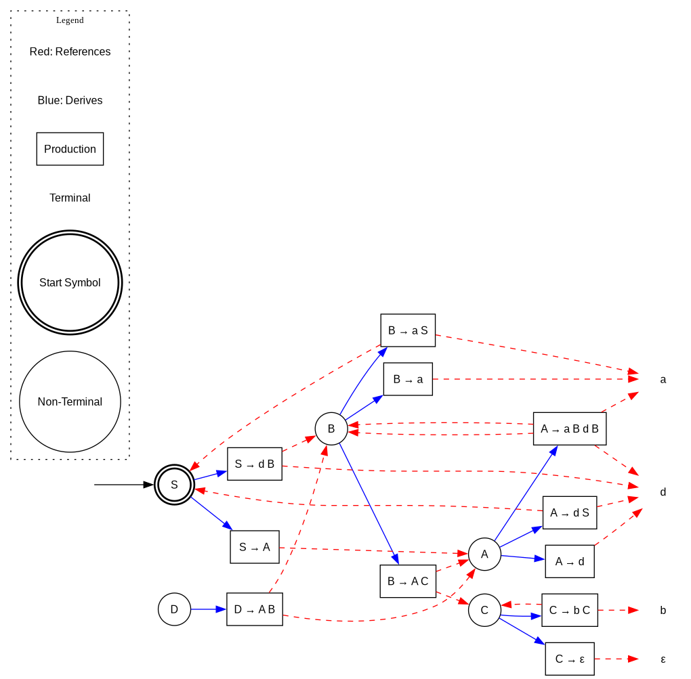
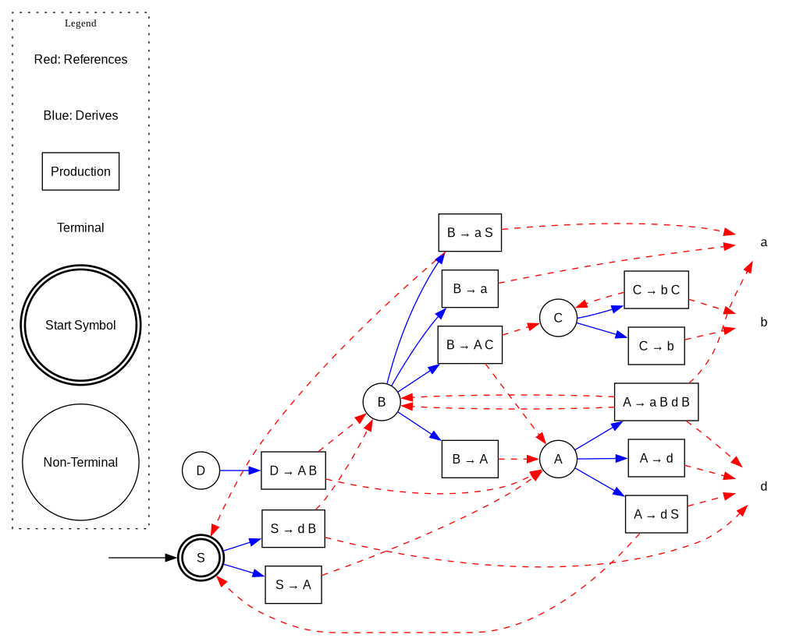
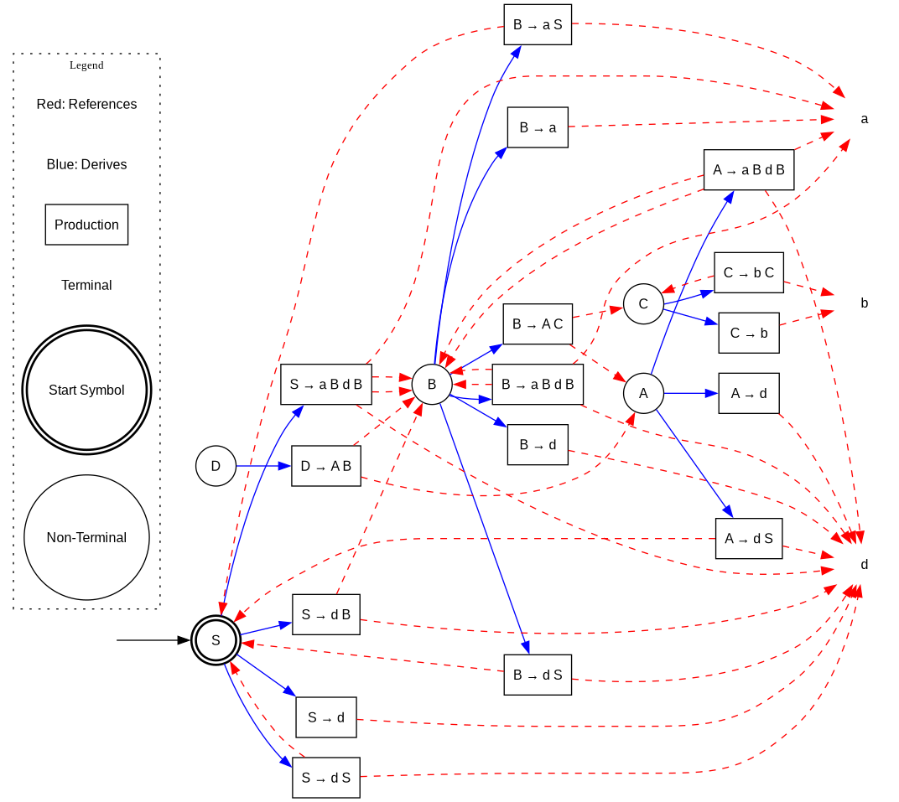
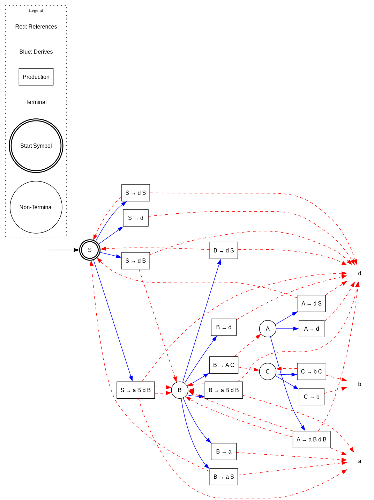
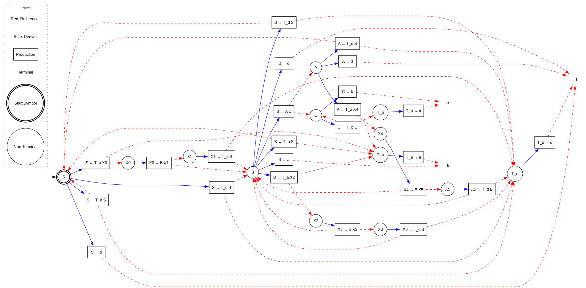

# Laboratory Work 5

## Theory and Definitions

### Context-Free Grammars

A context-free grammar (CFG) is a formal grammar that consists of a finite set of production rules where each production has a single nonterminal on the left-hand side. Context-free grammars are more powerful than regular expressions and are used to describe context-free languages, which include programming languages, mathematical expressions, and other hierarchical structures.

Formally, a context-free grammar G is defined as a 4-tuple G = (V, Σ, R, S) where:
- V is a finite set of non-terminal symbols or variables
- Σ is a finite set of terminal symbols (disjoint from V)
- R is a finite set of production rules, each of the form A → α, where A ∈ V and α ∈ (V ∪ Σ)*
- S ∈ V is the start symbol

### Chomsky Normal Form

Chomsky Normal Form (CNF) is a simplified form of context-free grammar where all production rules have one of the following forms:
- A → BC, where A, B, and C are non-terminal symbols (B and C may not be the start symbol)
- A → a, where A is a non-terminal symbol and a is a terminal symbol
- S → ε, where S is the start symbol and ε is the empty string (only if the empty string is in the language)

A grammar in CNF has several desirable properties:
1. It is easier to parse (the CYK algorithm uses CNF for parsing in O(n³) time)
2. It eliminates redundancies and complexities from the grammar
3. It makes theoretical proofs simpler

### Steps to Convert a CFG to CNF

Converting a grammar to CNF involves several sequential transformations:

1. **Eliminate the Start Symbol from Right-Hand Sides**:
   - Create a new start symbol S₀
   - Add production S₀ → S (where S is the original start symbol)

2. **Eliminate ε-productions (Epsilon Removal)**:
   - Identify all nullable non-terminals (those that can derive ε)
   - For each production containing nullable non-terminals, create new productions by including/excluding those non-terminals
   - Remove all direct ε-productions

3. **Eliminate Renaming (Unit Productions)**:
   - For each unit production A → B, replace it with all productions of B
   - Ensure transitive unit productions are also handled

4. **Eliminate Inaccessible Symbols**:
   - Identify symbols reachable from the start symbol
   - Remove all productions with unreachable symbols

5. **Eliminate Non-Productive Symbols**:
   - Identify symbols that can derive a string of terminals
   - Remove all productions with non-productive symbols

6. **Convert Remaining Rules to CNF**:
   - Replace terminals in rules with more than two symbols by introducing new non-terminals
   - Break down rules with more than two symbols into binary rules

## Objectives

1. Learn about Chomsky Normal Form (CNF).
2. Get familiar with the approaches of normalizing a grammar.
3. Implement a method for normalizing an input grammar by the rules of CNF:
   - The implementation needs to be encapsulated in a method with an appropriate signature.
   - The implemented functionality needs to be executed and tested.
   - Bonus: Make the function accept any grammar, not only the one from the student's variant.

## Implementation

For this laboratory work, I've implemented a system to convert any context-free grammar into Chomsky Normal Form. The implementation follows the step-by-step transformation process outlined above.

### Grammar Representation

I created a `GrammarV2` struct to represent a context-free grammar:

```go
type GrammarV2 struct {
    NonTerminals map[string]bool
    Terminals    map[string]bool
    Productions  map[string][][]string
    StartSymbol  string
    Epsilon      string

    counter int
}
```

The grammar is represented using:
- Sets of non-terminal and terminal symbols
- A map of productions where each key is a non-terminal and the value is a list of right-hand sides
- A start symbol and an epsilon representation
- A counter for generating new non-terminal symbols during CNF conversion

### Key Transformation Methods

The implementation includes several key methods to handle each step of the CNF conversion:

#### 1. Eliminate Epsilon Productions

```go
func (g *GrammarV2) EliminateEpsilon() {
    // Find nullable symbols
    nullable := make(map[string]bool)

    // Initial nullable symbols (direct ε productions)
    for lhs, prods := range g.Productions {
        for _, rhs := range prods {
            if len(rhs) == 1 && rhs[0] == g.Epsilon {
                nullable[lhs] = true
                break
            }
        }
    }

    // Propagate nullable symbols
    changed := true
    for changed {
        changed = false
        for lhs, prods := range g.Productions {
            if nullable[lhs] {
                continue
            }

            for _, rhs := range prods {
                allNullable := true
                for _, sym := range rhs {
                    if sym != g.Epsilon && (!nullable[sym] || g.Terminals[sym]) {
                        allNullable = false
                        break
                    }
                }

                if allNullable {
                    nullable[lhs] = true
                    changed = true
                    break
                }
            }
        }
    }

    // Generate combinations of productions without nullable symbols
    newProds := make(map[string][][]string)
    for lhs, prods := range g.Productions {
        for _, rhs := range prods {
            if len(rhs) == 1 && rhs[0] == g.Epsilon {
                continue // Skip direct epsilon productions
            }

            combinations := g.generateCombinations(rhs, nullable)
            for _, combo := range combinations {
                if len(combo) > 0 || lhs == g.StartSymbol {
                    g.addProductionToMap(newProds, lhs, combo)
                }
            }
        }
    }

    // If start symbol is nullable, add S -> ε
    if nullable[g.StartSymbol] {
        g.addProductionToMap(newProds, g.StartSymbol, []string{g.Epsilon})
    }

    g.Productions = newProds
}
```

This method identifies all nullable symbols and generates new productions by considering all possible combinations of including/excluding nullable symbols.

#### 2. Eliminate Unit Productions (Renaming)

```go
func (g *GrammarV2) EliminateRenaming() {
    // Find all unit pairs
    unitPairs := make(map[string]map[string]bool)

    // Initialize with direct unit productions
    for lhs := range g.NonTerminals {
        unitPairs[lhs] = make(map[string]bool)
        unitPairs[lhs][lhs] = true // A -> A is a unit pair
    }

    for lhs, prods := range g.Productions {
        for _, rhs := range prods {
            if len(rhs) == 1 && g.NonTerminals[rhs[0]] {
                unitPairs[lhs][rhs[0]] = true
            }
        }
    }

    // Compute transitive closure
    changed := true
    for changed {
        changed = false
        for a := range unitPairs {
            for b := range unitPairs[a] {
                for c := range unitPairs[b] {
                    if !unitPairs[a][c] {
                        unitPairs[a][c] = true
                        changed = true
                    }
                }
            }
        }
    }

    // Create new productions
    newProds := make(map[string][][]string)
    for lhs := range g.NonTerminals {
        newProds[lhs] = [][]string{}
    }

    for a := range unitPairs {
        for b := range unitPairs[a] {
            for _, rhs := range g.Productions[b] {
                if len(rhs) != 1 || !g.NonTerminals[rhs[0]] {
                    g.addProductionToMap(newProds, a, rhs)
                }
            }
        }
    }

    g.Productions = newProds
}
```

This method identifies all unit pairs (e.g., A → B directly or indirectly) and replaces them with the non-unit productions of the target non-terminal.

#### 3. Eliminate Inaccessible Symbols

```go
func (g *GrammarV2) EliminateInaccessibleSymbols() {
    accessible := make(map[string]bool)

    // Start with the start symbol
    accessible[g.StartSymbol] = true
    changed := true

    for changed {
        changed = false
        for lhs := range accessible {
            for _, rhs := range g.Productions[lhs] {
                for _, sym := range rhs {
                    if g.NonTerminals[sym] && !accessible[sym] {
                        accessible[sym] = true
                        changed = true
                    }
                }
            }
        }
    }

    // Keep only productions with accessible symbols
    newProds := make(map[string][][]string)
    for lhs := range accessible {
        if prods, exists := g.Productions[lhs]; exists {
            newProds[lhs] = prods
        }
    }

    g.Productions = newProds

    // Update non-terminals
    for nt := range g.NonTerminals {
        if !accessible[nt] {
            delete(g.NonTerminals, nt)
        }
    }
}
```

This method identifies all symbols reachable from the start symbol and removes productions involving unreachable symbols.

#### 4. Eliminate Non-Productive Symbols

```go
func (g *GrammarV2) EliminateNonProductiveSymbols() {
    productive := make(map[string]bool)

    // All terminals are productive
    for t := range g.Terminals {
        productive[t] = true
    }

    // Find productive non-terminals
    changed := true
    for changed {
        changed = false
        for lhs, prods := range g.Productions {
            if productive[lhs] {
                continue
            }

            for _, rhs := range prods {
                allProductive := true
                for _, sym := range rhs {
                    if sym != g.Epsilon && !productive[sym] {
                        allProductive = false
                        break
                    }
                }

                if allProductive {
                    productive[lhs] = true
                    changed = true
                    break
                }
            }
        }
    }

    // Keep only productive productions
    newProds := make(map[string][][]string)
    for lhs, prods := range g.Productions {
        if !productive[lhs] {
            continue
        }

        newProds[lhs] = [][]string{}
        for _, rhs := range prods {
            allProductive := true
            for _, sym := range rhs {
                if sym != g.Epsilon && !productive[sym] {
                    allProductive = false
                    break
                }
            }

            if allProductive {
                newProds[lhs] = append(newProds[lhs], rhs)
            }
        }
    }

    g.Productions = newProds

    // Update non-terminals
    for nt := range g.NonTerminals {
        if !productive[nt] {
            delete(g.NonTerminals, nt)
        }
    }
}
```

This method identifies all symbols that can derive a string of terminals and removes non-productive symbols and associated productions.

#### 5. Convert to CNF

```go
func (g *GrammarV2) ConvertToCNF() {
    // Step 1: Create terminal wrappers
    terminalWrappers := make(map[string]string)
    terminalProds := make(map[string][][]string)

    // First pass: collect terminal productions
    for _, prods := range g.Productions {
        for _, rhs := range prods {
            if len(rhs) > 1 {
                for _, sym := range rhs {
                    if g.Terminals[sym] && terminalWrappers[sym] == "" {
                        wrapper := fmt.Sprintf("T_%s", sym)
                        terminalWrappers[sym] = wrapper
                        g.NonTerminals[wrapper] = true
                        terminalProds[wrapper] = [][]string{{sym}}
                    }
                }
            }
        }
    }

    // Second pass: replace terminals in long productions
    newProds := make(map[string][][]string)
    for lhs, prods := range g.Productions {
        newProds[lhs] = [][]string{}

        for _, rhs := range prods {
            if len(rhs) <= 1 {
                // Keep A -> a and A -> B as is
                newProds[lhs] = append(newProds[lhs], rhs)
                continue
            }

            // Replace terminals in productions with length > 1
            newRhs := make([]string, len(rhs))
            for i, sym := range rhs {
                if g.Terminals[sym] {
                    newRhs[i] = terminalWrappers[sym]
                } else {
                    newRhs[i] = sym
                }
            }

            // Break down long productions
            if len(newRhs) > 2 {
                currentLhs := lhs
                for i := 0; i < len(newRhs)-2; i++ {
                    newNT := fmt.Sprintf("X%d", g.counter)
                    g.counter++
                    g.NonTerminals[newNT] = true
                    newProds[currentLhs] = append(newProds[currentLhs], []string{newRhs[i], newNT})
                    currentLhs = newNT
                }
                // Add the last production with the last two symbols
                newProds[currentLhs] = append(newProds[currentLhs], []string{newRhs[len(newRhs)-2], newRhs[len(newRhs)-1]})
            } else {
                // If length is 2, just add it
                newProds[lhs] = append(newProds[lhs], newRhs)
            }
        }
    }

    // Add terminal wrapper productions
    for wrapper, prods := range terminalProds {
        newProds[wrapper] = prods
    }

    g.Productions = newProds
}
```

This method converts all remaining productions to CNF by:
1. Creating special non-terminals for terminals in longer productions
2. Breaking down productions with more than two symbols into binary productions

### Complete Normalization Process

The complete normalization process is encapsulated in the `Normalize` method:

```go
func (g *GrammarV2) Normalize() {
    g.EliminateEpsilon()
    g.EliminateRenaming()
    g.EliminateInaccessibleSymbols()
    g.EliminateNonProductiveSymbols()
    g.ConvertToCNF()
}
```

### Visualization

To visualize the grammar transformations, I implemented a method to generate DOT files for Graphviz:

```go
func (g *GrammarV2) ToDOT(filename string) error {
    file, err := os.Create(filename)
    if err != nil {
        return err
    }
    defer file.Close()

    fmt.Fprintln(file, "digraph Grammar {")
    fmt.Fprintln(file, "  rankdir=LR;")
    fmt.Fprintln(file, "  node [fontname=\"Helvetica\", fontsize=12];")
    fmt.Fprintln(file, "  edge [fontname=\"Helvetica\", fontsize=10];")

    // Special start symbol
    fmt.Fprintln(file, "  \"start\" [shape=none, label=\"\"];")
    fmt.Fprintf(file, "  \"start\" -> \"%s\";\n", g.StartSymbol)

    // Nodes for non-terminals
    for nt := range g.NonTerminals {
        if nt == g.StartSymbol {
            fmt.Fprintf(file, "  \"%s\" [shape=circle, style=bold, peripheries=2];\n", nt)
        } else {
            fmt.Fprintf(file, "  \"%s\" [shape=circle];\n", nt)
        }
    }

    // Add productions as boxes
    // ...

    fmt.Fprintln(file, "}")
    return nil
}
```

This generates DOT files that can be converted to PNG images using Graphviz.

## Results
TODO: fix grammar text here from prog outpt

### Original Grammar Visualization

The original grammar has the following productions:

```
S → dB | A
A → d | dS | aBdB
B → a | aS | AC
D → AB
C → bC | ε
```

The visualization of this grammar is shown below:



### Step 1: Eliminate Epsilon Productions

After eliminating epsilon productions, the grammar is transformed to:



### Step 2: Eliminate Renaming

After eliminating unit productions (renaming), the grammar is transformed to:



### Step 3: Eliminate Inaccessible Symbols

After eliminating inaccessible symbols, the grammar is transformed to:



### Step 4: Eliminate Non-Productive Symbols

After eliminating non-productive symbols, the grammar is transformed to:


### Step 5: Convert to Chomsky Normal Form

Finally, after converting to CNF, the grammar has only productions of the form A → BC or A → a:



The long productions are broken down into binary productions using new non-terminals (X0, X1, ...).

## Analysis of Transformations

### Epsilon Elimination

The epsilon elimination phase identified that only the symbol C was nullable (could derive ε). It then:
1. Removed the direct C → ε production
2. Generated new productions where C appears, considering both including and excluding C
   - B → AC became B → A (by excluding C)

### Renaming Elimination

The renaming elimination phase identified unit productions like A → A and replaced them with their corresponding productions. This resulted in duplicate productions which were handled appropriately.

### Inaccessible Symbols Elimination

The inaccessible symbols phase identified that the symbol D was not reachable from the start symbol S, so:
1. It removed D from the set of non-terminals
2. It removed all productions with D on the left-hand side

### Non-Productive Symbols Elimination

All symbols in the grammar were productive (could derive a string of terminals), so no changes were made in this phase.

### Chomsky Normal Form Conversion

The final step converted all remaining productions to CNF by:
1. Creating special non-terminals for terminals in longer productions (T_a, T_b, T_d)
2. Breaking down longer productions like A → aBdB into binary productions using new non-terminals (X0, X1, ...)

## Conclusion

This laboratory work demonstrates the process of converting a context-free grammar to Chomsky Normal Form. The implementation follows the theoretical steps required for CNF conversion, with clear visualization of each transformation stage.

The key insights from this work include:
1. The importance of handling epsilon productions carefully
2. The need to eliminate indirect unit productions through transitive closure
3. The value of removing inaccessible and non-productive symbols to simplify the grammar
4. Techniques for breaking down complex productions into the binary form required by CNF

The resulting implementation is general purpose and can handle any context-free grammar, not just the specific test grammar used in this example. The transformations are applied systematically, ensuring that the resulting grammar is equivalent to the original in terms of the language it generates.

The visualizations created at each step provide valuable insights into how the grammar structure evolves during the normalization process, making it easier to understand and validate the transformations.

## References

[1] Chomsky, N. (1959). "On certain formal properties of grammars". Information and Control. 2 (2): 137–167.
